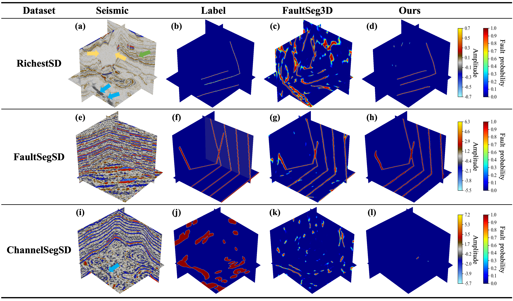

# Rich Geological Features Are All You Need: Seismic Structure Identification Using Deep Learning in Complex Geological Contexts
<p align="center" width="100%">

</p>
This is a repository for the paper "Rich Geological Features Are All You Need: Seismic Structure Identification Using Deep Learning in Complex Geological Contexts". This study reveals the impact of limited geological features in training datasets on deep learning-based seismic structure identification. In this paper, we present a parametric 3D geological structure modeling framework for generating seismic data and corresponding structural labels that include dip, fold, unconformity, channel, cave, salt body, and composite fault structures. To the best of our knowledge, this dataset contains the richest structural features among existing synthetic seismic datasets.

-----------------


# Abstract
Identifying geological structures from seismic images is a critical step in understanding the Earth's evolutionary history, assessing geological disasters, and predicting resource distribution.  Recently, the robust capabilities for big data processing and nonlinear modeling offered by deep learning have led to its widespread attention in seismic structure identification. To avoid the extensive effort and resources required for manual labeling of seismic data, researchers have used synthetic seismic data with structure labels generated by numerical simulation to train deep learning models. However, these studies are task-oriented, simplifying and ignoring some common and important geological features during the simulation process, which limits the performance of the model on specific datasets. To further improve the generality and flexibility of deep learning models for structure identification on datasets with complex structural features, we propose a parametric 3D structure modeling framework for the numerical simulation of synthetic seismic data that include dip, fold, unconformity, channel, cave, salt body, and composite fault structure. Moreover, we revise some simulation solutions to make the simulated geological structures closer to the real ones. To the best of our knowledge, this dataset is the synthetic seismic dataset with the richest structural features to date. Applications of fault identification on several synthetic and field seismic datasets reveal that the deep learning model trained on datasets with limited geological features is prone to learn biased representations, which can cause the model to misclassify unseen geological structures with similar seismic responses to the target structure. The deep learning model trained on our proposed dataset significantly reduces the false positive rate of structures with similar seismic responses and improves the fault identification accuracy on datasets with complex geological features. Although this study focuses only on fault identification, the proposed synthetic seismic dataset can be easily adapted to identify other structural types.

# How to Use
## 1. Via Anaconda or pip (recommended):
    conda env create -f environment.yml
    conda activate RichGeo

## 2. We provide [trained weights](https://github.com/leilin1995/Rich-Geological-Features-Are-All-You-Need/tree/master/Results/Unet3D) for 3D fault segmentation. You can use it to predict your own data and perform transfer learning. Please note that you need to normalize your data to the range of 0 to 1.

## 3. Predict your own data. Please note that your data needs to be saved in .hdf5 format, and the internal path for the seismic data should be set to 'seismic'.
```bash
python predict.py --input_dir=your_data_dir --save_dir=your_save_dir --trained_model=../Results/Unet3D/model.pt 
```

## 4. For transfer learning.
```bash
python main.py --max_epochs=100 --optim_lr=0.0001 --resume_ckpt=True --pretrained_pth=../Results/Unet3D/model.pt --training_dir=your_train_dir --validation_dir=your_validation_dir  
```

## 5. Evaluation models (Metrics: Pixel_Accuracy, Mean_Pixel_Accuracy, Precision_rate, Recall_rate, IOU, Dice, F1)
```bash
python evaluation.py --label_dir=your_label_dir --pred_dir=your_pred_dir --save_dir=your_save_dir  
```

# Citation
If the code and paper help your research, please kindly cite:
```
@article{
}
```
# License
This project is released under the [MIT license](LICENSE).

# Test results
We compare the deep learning model trained on the proposed dataset with the most popular open-source fault identification study, [FaultSeg3D](https://github.com/xinwucwp/faultSeg), on multiple datasets. The neural network architectures we use are both 3D U-net. The training dataset of FaultSeg3D contains only dip, fold, and fault structures. The training dataset of our model includes dip, fold, unconformity, channel, cave, salt body, and composite fault structures.

## Test on synthetic examples
Fault identification results on three synthetic seismic cases. The first row shows the results from a case in the RichestSD test dataset. The second row presents results from a case in the FaultSegSD \cite{wu_faultseg3d_2019} validation dataset. The third row demonstrates results from a case in the ChannelSegSD \cite{gao_channelseg3d_2021} validation dataset. (a), (e), and (i) are input seismic images. (b), (f), and (j) show the labeled data. Note that (b) and (f) display fault labels, while (j) displays channel labels. (c), (g), and (k) present the fault probability predicted by the FaultSeg3D model \cite{wu_faultseg3d_2019} trained on the FaultSegSD dataset. (d), (h), and (l) display the fault probability predicted by the model trained on the RichestSD dataset proposed in this paper.

## Test on multiple field examples
We compare the deep learning model trained on the proposed dataset with the most popular open-source fault identification study, [FaultSeg3D], on multiple datasets. The neural network architectures we use are both 3D U-net.
### Opunake-3D
Fault identification results on Opunake-3D data. (a) Seismic image. (b) Fault labels annotated by interpreters. (c) Fault detection results predicted by FaultSeg3D. (d) Fault detection results using the 3D U-net trained on the proposed dataset.

### F3
Fault identification results on F3 dataset. (a) Seismic image. (b) Fault detection results predicted by FaultSeg3D. (c) Fault detection results using the 3D U-net trained on the proposed dataset. (d), (e), and (f) show seismic and fault slices at inline 90. (g) The seismic textural patterns interpretation by Di et al. (2019) \cite{di_developing_2019} on F3 dataset at inline 90, including seven depositional facies (1 to 7), regressive and transgressive sequences (8 and 9), faults (10), salt (11), and gas chimneys (12).

### LSOF
Fault identification results on a field seismic image from offshore Louisiana. (a) Seismic image. (b) Fault prediction results using FaultSeg3D. (c) Fault detection results using the 3D U-net trained on the proposed dataset. (d) Channel probability map predicted by Gao et al. \cite{gao_channelseg3d_2021}. (e)-(h) Seismic, predicted fault, and channel slices at timeline 152.
